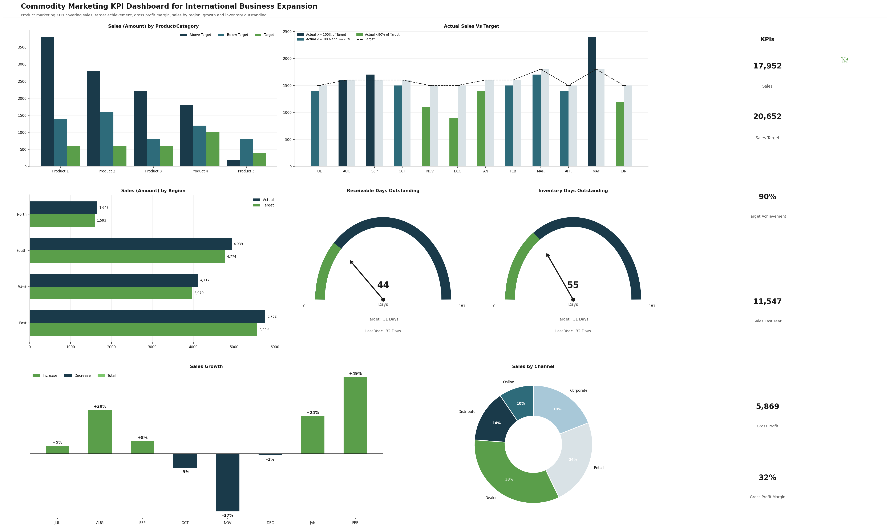

# Market Expansion Analytics

An end-to-end commodity marketing KPI dashboard for international business
expansion tracking sales performance, target achievement, regional analysis,
and inventory metrics across 5 products, 4 regions, and 5 channels.

## Business Summary
- **Total Sales:** 17,952
- **Sales Target:** 20,652
- **Target Achievement:** 90%
- **Sales Last Year:** 11,547
- **Gross Profit:** 5,869
- **Gross Profit Margin:** 32%
- **Period:** July 2023 - June 2024

## Dashboard Visualizations

## Dashboard Sections
1. **Sales by Product/Category** — Above Target, Below Target, Target grouped bars
2. **Actual Sales vs Target** — Monthly bar chart with color-coded achievement
3. **KPI Cards** — Sales, Sales Target, Target Achievement, Sales Last Year, Gross Profit, Gross Profit Margin
4. **Sales by Region** — East, West, South, North actual vs target horizontal bars
5. **Receivable Days Outstanding** — Gauge chart (44 days vs 31 day target)
6. **Inventory Days Outstanding** — Gauge chart (55 days vs 31 day target)
7. **Sales Growth** — Monthly waterfall chart with % labels
8. **Sales by Channel** — Donut chart across Online, Distributor, Dealer, Retail, Corporate

## Key Insights
| Metric | Value | Target | Status |
|---|---|---|---|
| Target Achievement | 90% | 100% | ⚠️ Below |
| East Region Sales | 5,762 | 5,569 | ✅ Above |
| Receivable Days | 44 days | 31 days | ⚠️ High |
| Inventory Days | 55 days | 31 days | ⚠️ High |
| Feb Sales Growth | +49% | — | ✅ Strong |
| Gross Profit Margin | 32% | — | ✅ Healthy |

## Technologies
- Python, Pandas, NumPy
- Matplotlib (Custom Gauge Charts)
- Google Colab (T4 GPU)
